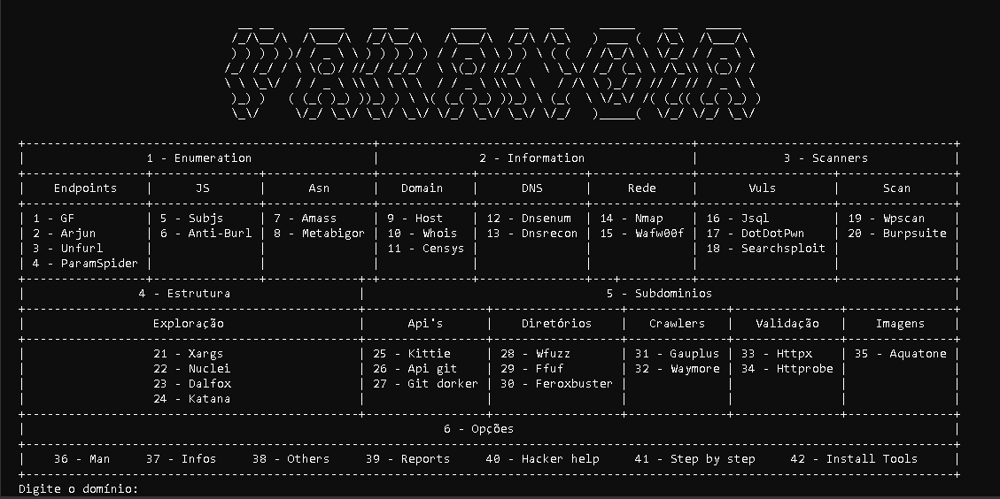

<h1 align="center">PARANOIA</h1>

Essa é uma ferramenta com o próposito de ajudar na execução de ferramentas que são tanto conhecidas tanto poucos conhecidas, com a instalação delas e uma descrição detalhada de cada junto com seus comandos, os comandos pré-prontos servem para a maioria dos casos e pode ajudar no auxílo de bug bountys e no aprendizado de vulnerabilidades web.

Eu pretendo futuramente adicionar mais ferramentas e mais funções, portanto essa ainda é uma versão beta da ferramenta.

### Install:

```bash
git clone https://github.com/k-o-g-e-r-u/Paranoia.git
python3 Paranoia/paranoia.py
```

</img>
